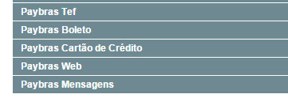
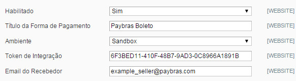
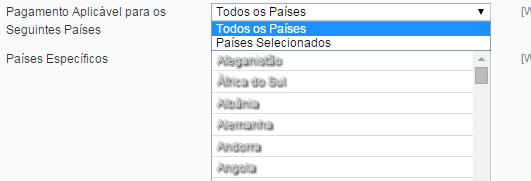
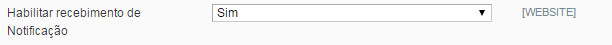
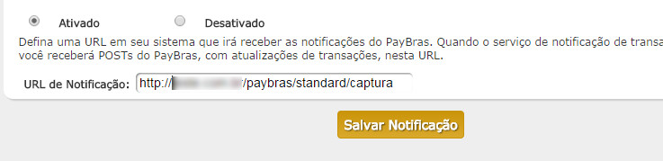
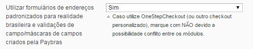
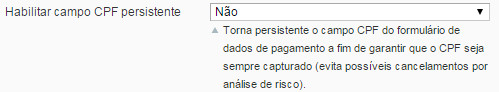

Módulo Magento Paybras
==============================

Instruções
--------------

Recomendamos que primeiramente realize backup completo do seu site, banco de dados e arquivos. A Paybras não se responsabiliza por quaisquer danos ou prejuízos financeiros decorrentes da má utilização ou instalação desse módulo.

Requerimentos
--------------

- Compatibilidade testada com Magento Community nas versões 1.4.x.x, 1.5.x.x, 1.6.x.x, 1.7.x.x, 1.8.x.x, 1.9.x.x e Magento Enterprise 1.9.x.x e 1.10.x.x (não foi testado para Magento Enterprise 1.11.x.x e superiores).
- PHP 5.2.0 ou superior (nativamente o Magento não suporta PHP 5.4 ou superiores, mas o módulo não possui nenhuma implementação incompatível com tais versões) 

Instalações
--------------

Faça o download do arquivo .zip do módulo (provavelmente já o fez). Descompactar os arquivos para uma pasta qualquer em seu computador, por exemplo, nova pasta. 

Desabilite o cache do Magento através do menu SISTEMA -> GERENCIAMENTO DE CACHE Clique em SISTEMA -> CONFIGURAÇÃO e desabilite a compilação em SISTEMAS -> FERRAMENTAS -> COMPILAÇÃO.

Envie todos os arquivos e pastas que foram descompactados em sua pasta raiz do Magento.

Configuração
--------------

Na tela de configuração (SISTEMA -> CONFIGURAÇÃO) acessar a seção MÉTODOS DE PAGAMENTOS. Nessa seção existem todos as configurações do Paybras, como podemos ver a seguir.

-><-

Além dessas 4 abas, existe uma aba Paybras Mensagens, que será descrita com mais detalhes a seguir.

Cada forma de pagamento funciona como um módulo independente, dessa forma você pode criar regras promocionais e restrições em sua loja para cada forma de pagamento Paybras: Cartão de Crédito, TEF, Boleto e Checkout Web (Redirecionamento para domínio seguro Paybras).

Para cada forma de pagamento temos os campos obrigatórios para funcionamento: Habilitado (Sim/Não), Título da forma de pagamento (será exibido no checkout da loja para escolha do usuário), E-mail do Recebedor (e-mail da sua conta Paybras), Token de Integração (token gerado no seu painel Paybras), Ambiente (Produção ou Sandbox).

-><-

Além disso, todas as formas possuem a funcionalidade de limitar seu funcionamento por países em especifico, de acordo com outras funções nativas do Magento.

-><-

Para configurar corretamente a capturar automática das notificações de status, além de ativar o campo "Habilitar recebimento de Notificação", você deve utilizar a seguinte URL de Integração no seu painel Paybras: http://www.minhaloja.com.br/paybras/standard/captura

-><-
-><-

Para garantir a integridade e padrão dos dados dos clientes e pedidos a serem enviados ao Paybras, o módulo possui opções de carregamento de template de formulários com campos padronizados, validações e máscaras para evitar formatos inválidos de telefones, datas de nascimento, CPF e campos de endereço. É necessário cuidado com essa opção pois ela pode alterar consideravelmente seu tema caso você possua formulários personalizados para tais fins.

-><-

A partir da versão 1.1.0 foi adicionado o campo de CPF persistente. Tal campo consiste em habilitar um input no formulário da forma de pagamento que irá ser enviado para o Paybras como o CPF do pagador do pedido. Mesmo que a loja já possua tal campo irá sobrescrever a informação de CPF no Paybras. Importante notar que esse campo não se aplica para cadastro na loja. Ele foi concebido para ser habilitado em casos em que a loja não tem as informações/formulários para capturar CPF do cliente de forma padronizada.

-><-

As formas Boleto, TEF e Web possibilitam adição de um texto personalizável ao formulário da forma de pagamento, nos campos "Textos para seção [...]".

Customização
--------------

É possível efetuar modificações visuais via CSS (skin/frontend/default/default/css/paybras.css) e modificando o HTML dos formulários nos seguintes arquivos.

- Formulário da forma de pagamento Cartão de Crédito: app/design/frontend/base/default/template/xpd/paybras/form/cc.phtml
- Formulário da forma de pagamento Tef: app/design/frontend/base/default/template/xpd/paybrastef/form/tef.phtml
- Formulário da forma de pagamento Boleto: app/design/frontend/base/default/template/xpd/paybrasboleto/form/boleto.phtml

Observação: O módulo possui carregamento de vários arquivos de Javascript. Ao utilizar temas customizados pode ser necessário fazer alterações para garantir o carregamento correto de bibliotecas nos formulários de endereço, a fim de garantir a padronização da entrada dos dados.
